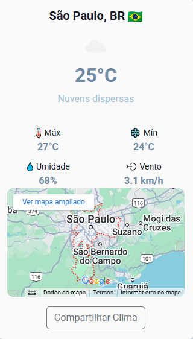
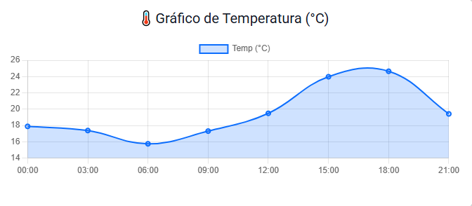
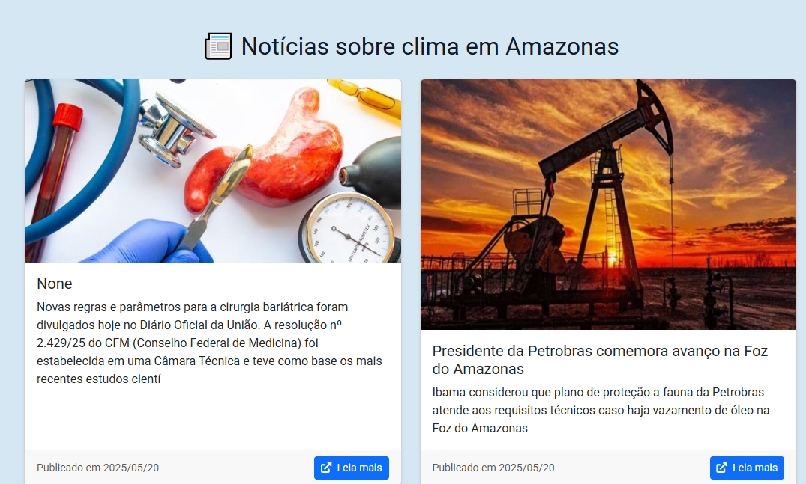

# 🌤️ Conexão Climática

Um aplicativo web responsivo que exibe o clima atual, previsão dos próximos dias e gráfico de temperatura por cidade — com base na OpenWeather API. Também traz notícias ambientais e permite compartilhar o clima!

---

## 🚀 Demonstração

Acesse agora 👉 [https://conexao-climatica.onrender.com](https://conexao-climatica.onrender.com)  


---

## 🧭 Funcionalidades

- 🔍 Busca de cidades
- 📊 Gráfico dinâmico de temperatura (Chart.js)
- 📅 Cards de previsão diária com interação (mudam com avanço dos dias)
- 🗺️ Mapa com localização da cidade (Google Maps Embed)
- 📢 Compartilhar clima via navegador ou copiar
- 📰 Notícias principalmente sobre a cidade buscada
- 📧 Cadastro para receber alertas via e-mail (Flask-Mail)
- ⚠️ Sistema de email para alertar sobre risco/emergencia de mudanças climaticas drasticas. 

---

## 🖼️ Capturas de Tela

| Clima Atual | Gráfico | Notícias |
|-------------|---------|----------|
|  |  |  |

---

## 🧪 Tecnologias Utilizadas

| Frontend     | Backend      | APIs             | Outros            |
|--------------|--------------|------------------|-------------------|
| HTML5 + CSS3 | Flask (Python) | OpenWeather API  | Flask-Mail        |
| Bootstrap 5  | Jinja2       | NewsAPI.org      | python-dotenv     |
| JS Vanilla   |              | Google Maps Embed | Chart.js          |

---

## ⚙️ Como executar localmente

### 🔧 Pré-requisitos

- Python 3.10+
- pip
- Conta gratuita na [OpenWeather](https://openweathermap.org/) e [NewsAPI](https://newsapi.org/)

### 📥 Clonar o repositório

```bash

git clone https://github.com/seu-usuario/conexao-climatica.git
cd conexao-climatica

🛠️ Instalar dependências

bash
pip install -r requirements.txt


🔐 Criar arquivo .env
Crie um arquivo chamado .env na raiz do projeto com o seguinte conteúdo:

.env

- OPENWEATHER_API_KEY=sua_chave_openweather
- NEWSAPI_KEY=sua_chave_newsapi
- MAIL_USERNAME=seu_email@gmail.com
- MAIL_PASSWORD=sua_senha_de_app

▶️ Rodar o servidor

bash
python app.py

👨‍💻 Autor
Desenvolvido por Gustavo S. Saray
(2025)

🔗 Contato:
gustavosaray2@gmail.com


